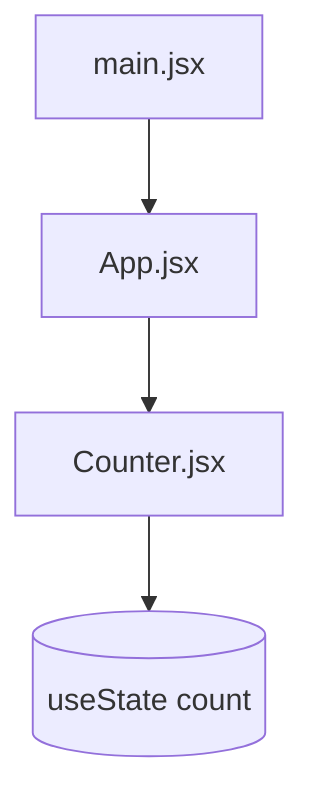

<div align="center">

# Simple Counter (React + Vite)

A **minimal counter UI** built with **React 18** and **Vite 5**: increment, decrement, and reset with `useState`, plus a simple layout (header, centered main, footer). Good starter for learning hooks and component structure.

[](https://react.dev/)
[](https://vitejs.dev/)
[](https://eslint.org/)

</div>

---

## Table of contents

- [Overview](#overview)
- [Features](#features)
- [Tech stack](#tech-stack)
- [Project structure](#project-structure)
- [How it works](#how-it-works)
- [Prerequisites](#prerequisites)
- [Scripts](#scripts)
- [Getting started](#getting-started)
- [Accessibility](#accessibility)
- [Notes](#notes)
- [Original README gallery](#original-readme-gallery)

---

## Overview

This repository is a **Vite-powered React SPA** focused on a single **`Counter`** component. The app shell in **`App.jsx`** adds a title (“Simple Counter App”) and a footer referencing **Dayananda Sagar University**. Styling lives mainly in **`index.css`** (layout, header/footer blues, large numeric display, responsive buttons).

> **Repository name:** The GitHub repo is spelled **`Simple-counter-wesbsite`** (typo in “website”). Renaming the repo on GitHub is optional but recommended for a cleaner URL.

---

## Features

| | |
|---:|---|
| **Increment / decrement / reset** | Three buttons update shared `count` state |
| **Large readout** | `.count-display` shows the current value prominently |
| **Responsive layout** | Buttons stack full-width on small screens (`@media max-width: 768px`) |
| **Basic a11y** | `aria-label` on container and buttons; `role="status"` on count |

---

## Tech stack

| Layer | Choice |
|--------|--------|
| UI | **React 18** + **react-dom** |
| Tooling | **Vite 5**, **`@vitejs/plugin-react`** |
| Lint | **ESLint 9** + React / hooks / refresh plugins |
| Styles | Global **`index.css`** (no CSS-in-JS) |

---

## Project structure

```
Simple-counter-wesbsite/
├── index.html          # Vite entry HTML
├── main.jsx            # createRoot + <StrictMode><App /></StrictMode>
├── App.jsx             # Layout: header, <Counter />, footer
├── Counter.jsx         # useState + increment / decrement / reset
├── index.css           # Global + counter styles
├── App.css             # Default Vite template leftovers (mostly unused)
├── vite.config.js
├── eslint.config.js
├── package.json
└── assets/             # SVG assets (e.g. react.svg)
```

Legacy **`index.js`** in the repo mirrors an older `ReactDOM.createRoot` entry; **Vite uses `main.jsx`** as configured in `index.html`.

---

## How it works



- **`Counter.jsx`** holds `const [count, setCount] = useState(0)` and handlers that call `setCount` (functional updates for +/-).
- **`App.jsx`** composes the page chrome and renders `<Counter />`.
- **`index.css`** defines `.counter-container`, `.count-display`, `.counter-button`, header/footer colors, and media queries.

---

## Prerequisites

- **Node.js** 18+ (LTS recommended)
- **npm** (comes with Node)

---

## Scripts

| Command | Purpose |
|---------|---------|
| `npm run dev` | Start Vite dev server (HMR) |
| `npm run build` | Production build to `dist/` |
| `npm run preview` | Preview the production build locally |
| `npm run lint` | Run ESLint on the project |

---

## Getting started

```bash
git clone https://github.com/PRAJWAL-BR-0304/Simple-counter-wesbsite.git
cd Simple-counter-wesbsite
npm install
npm run dev
```

Open the URL Vite prints (usually **http://localhost:5173**).

---

## Accessibility

Buttons expose **`aria-label`** (“Increment”, “Decrement”, “Reset”). The count is wrapped with **`role="status"`** so assistive tech can announce changes. You can extend this with live regions or reduced-motion tweaks as you grow the app.

---

## Notes

- **`package.json`** `name` is currently **`my-react-appp`** (typo); you can rename to match the project when convenient.
- Footer **Privacy Policy** link is a placeholder (`href="#"`).
- **`App.css`** still contains starter rules from the Vite template; most styling is driven by **`index.css`**.

---

## Original README gallery

The blocks below are **preserved from the earlier README** (website screenshots and code-snippet screenshots).

Website_images:-


Code_snippets:-


